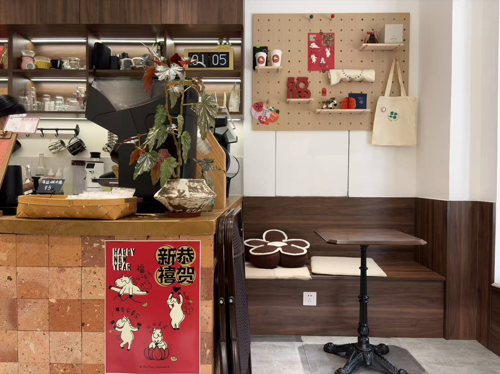
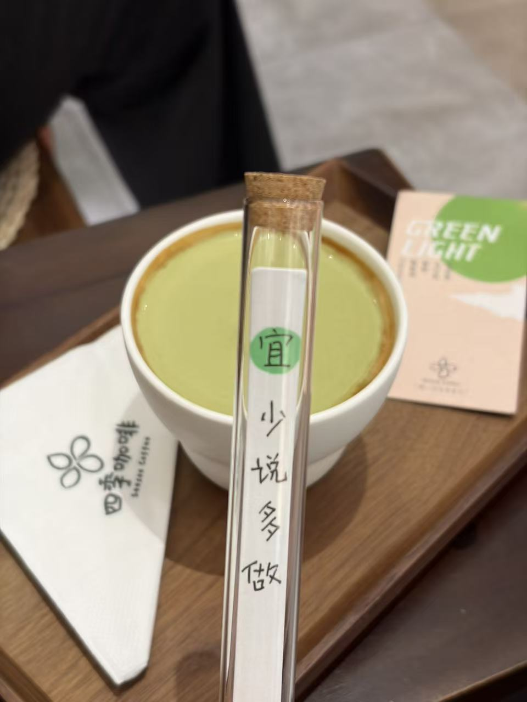

# xhs-notes-skill（图文笔记.skill）

<p align="center">
  <strong>给 AI Agent 装上一套小红书图文笔记创作工作流。</strong>
</p>

<p align="center">
  <a href="LICENSE"></a>
  
  
  
</p>

`xhs-notes-skill` 是一个面向小红书/XHS/RedNote 图文内容创作的 Agent Skill。它不是单个“爆款文案 Prompt”，而是一套可复用的内容生产流程：看图、主动提问、脑暴主题、拆选题、规划图片、写标题正文、补标签和评论钩子，并在发布前做风险检查。

适合创作者、运营、品牌内容团队，把一张随手拍、一个模糊想法或一段草稿，先梳理成清楚的内容方向，再生成更完整、更像真实发布内容的小红书图文笔记。

> **模型要求**：视觉理解模式必须使用支持图片输入和图片理解的多模态模型。纯文本模型无法读取原图，只能根据用户描述写作，效果会明显打折。

## 真实效果

### 实战样例：工作日中午的咖啡厅自我充电

拍几张真实图片，告诉 Agent 想创作的方向：

| 窗边封面图 | 店内环境图 | 饮品细节图 |
| --- | --- | --- |
|  |  |  |

```text
[上传 3 张工作日中午的咖啡厅随手拍]

用 xhs-notes-skill 看这张图，帮我写一篇小红书笔记。
方向：工作日中午自己去了一家宝藏咖啡厅、松弛感、反内卷、自我充电。
要求：标题有点击感，正文像真实分享，不要营销感；输出标签、评论钩子和发布前风险检查。
```

多模态模型会先读图，再把图里的可见信息转成笔记角度：

- 画面主体、光线、氛围、可写角度
- 不确定信息提示，避免编造店名、价格、地点
- 主动给出主题选项，像头脑风暴一样帮用户确定要写什么
- 继续确认内容方向、字数范围和内容风格
- 根据已确认主题生成选题方向，并让用户选择
- 3-5 个标题备选
- 一版可复制发布的正文
- 标签组合和置顶评论
- 发布提示与风险检查

脑暴式确认示例：

```text
我先确认主题，选项编号即可，也可以直接输入你的主题：

1. 工作日午休自我充电（推荐）
2. 宝藏咖啡厅探店
3. 打工人反内卷日常
4. 其他：我自己输入主题

用户选择：1

请确认内容方向、字数范围、内容风格：
用户选择：旅游，短，真实分享

我给你 3 个选题方向，选一个继续：
1. 城市旅行里的午休补给站
2. 工作日也可以有一点旅行感（用户选择）
3. 一个人的咖啡厅小逃离
```

精简输出示例：

```markdown
## 可复制发布区

# 图片
1. 图1：封面图
   - 使用：窗边木门 + 绿植 + 遮阳伞
   - 封面字：工作日中午，允许自己暂停一下

2. 图3：情绪细节图
   - 使用：绿色饮品 + “少说多做”纸签
   - 作用：承接“自我充电”和“反内卷”的主题

3. 图2：环境补充图
   - 使用：咖啡机、木色座位、墙面装饰
   - 作用：补足宝藏咖啡厅的安静氛围

# 标题
推荐标题：工作日中午，我偷偷去咖啡厅充了个电

备选标题：
1. 反内卷的一小时：中午自己去坐了会儿
2. 打工人午休回血，不一定要睡觉
3. 被这家安静咖啡厅治好了半天班味
4. 工作日中午的松弛感，是自己给自己的
5. “少说多做”，但今天先允许自己慢一点

# 正文
工作日中午，突然不想把午休也过得很赶。

没有约人，也没有安排什么特别的事，
就自己拐进了一家安静的小咖啡厅。

窗边有树影，门外是绿色的街景，
店里是木色的小桌、咖啡机和一点点生活痕迹。
点了一杯绿色的饮品，看到纸签上写着“少说多做”，莫名被安静到。

以前总觉得午休也要“有效率”：
回消息、刷信息、顺手再处理一点工作。
但今天突然觉得，反内卷也可以很小。

不是辞职去远方，
不是一定要拥有完整的一天，
而是在工作日中午，给自己留一小时不被催促的时间。

坐着发会儿呆，慢慢喝完一杯，
看窗外的树影晃一晃，
感觉人真的会从半天的紧绷里松回来一点。

自我充电不一定要很隆重。
有时候就是：中午不凑合，自己去坐坐。

# 标签
#工作日午休 #打工人自救 #反内卷生活 #松弛感 #自我充电 #咖啡厅日常 #一个人也很好 #午休去哪儿 #低成本回血 #生活碎片 #宝藏咖啡厅 #班味消除计划

# 评论钩子
置顶评论：你们工作日中午会怎么给自己充电？
引导问题：午休一小时，你会选择睡觉、散步，还是找家咖啡厅坐坐？
```

## 为什么值得用

多数小红书提示词只能生成一段文案。`xhs-notes-skill` 更像一个内容生产线：

- **看图**：基于多模态模型识别画面主体、氛围、构图、可写角度和不确定信息。
- **脑暴**：主动追问主题、方向、字数和风格，帮用户从模糊想法梳理到清楚选题。
- **策划**：根据已确认主题规划图片张数、封面、正文节奏和标签方向。
- **成稿**：输出标题、正文、标签、评论钩子，默认放进同一个可复制发布区。
- **生图**：为每张配图生成 Prompt，也可接入 OpenAI-compatible Images API。
- **澄清**：需求不完整时先做动态澄清，必要时给出选项框或 1-3 个关键问题。
- **风控**：检查夸大表达、功效承诺、违禁词、敏感赛道和 AI 图片标注。

## 功能

| 能力 | 说明 |
| --- | --- |
| 视觉理解模式 | 上传 1-10 张图片，使用多模态模型生成标题、正文、标签、评论钩子和图片排序方案 |
| 文字规划模式 | 输入主题、关键词或想法，生成完整图文笔记方案 |
| 草稿优化 | 把已有草稿改成更适合小红书发布的结构和语气 |
| 图片 Prompt 生成 | 为每张图输出可直接用于生图模型的 Prompt |
| 热梗热词 | 按场景加入平台流行表达，并提供时效校验规则 |
| 主题确认与动态澄清 | 像头脑风暴一样主动提问，先确认主题，再补问方向、字数和风格 |
| 直接生图 | 通过本地配置调用 OpenAI-compatible Images API |
| 风险检查 | 检查夸大表达、敏感赛道、违禁词、功效承诺和 AI 生成标注 |

## 一分钟上手

新会话里，直接用下面任意一种说法即可触发 Skill：

```text
用 xhs-notes-skill 根据这几张图写一篇小红书笔记，偏真实种草。
```

```text
我要做一篇小红书图文笔记，主题是“普通人周末低成本自我充电”，帮我规划图片和文案。
```

```text
把这段草稿改成小红书笔记，保留真实经历，增强标题、正文节奏、标签和评论钩子。
```

同一会话里可以继续多轮修改，不需要每次重复 Skill 名称：

```text
标题更热梗一点，但不要太油。
```

```text
正文改成更像真实朋友分享，不要营销感。
```

```text
再给我一个适合直接复制发布的版本。
```

## 基础用法

把本目录作为 Agent Skill 安装到支持 Agent Skills 的客户端中。客户端读取 `SKILL.md` 后，就可以通过自然语言触发。

如果要使用图片分析、图生文、随手拍成稿等能力，当前 Agent 必须接入支持图片输入的多模态模型；如果只使用文字规划模式，纯文本模型也可以运行。

常见触发方式：

```text
帮我根据这些图片写一篇小红书图文笔记
```

```text
我要做一篇关于“通勤包收纳”的小红书笔记，帮我规划图片和文案
```

```text
根据这个主题直接生成图片 Prompt，并调用生图模型出图
```

## 选择输入模式

| 你的输入 | 推荐模式 | 适合产出 |
| --- | --- | --- |
| 1-10 张图片 | 视觉理解模式 | 图生文、标题、正文、标签、评论钩子、图片排序 |
| 一个主题或想法 | 文字规划模式 | 图片张数方案、每张图 Prompt、完整图文笔记 |
| 已有草稿 | 草稿优化 | 标题重写、正文重排、标签补充、风险改写 |
| 需要图片 | 文字规划 + 生图 | Prompt、图片生成、输出文件路径 |
| 准备发布前检查 | 风险检查 | 风险词标注、替代表达、安全版本 |

## 首次执行会先确认什么

当你第一次要求执行 `xhs-notes-skill` 时，Agent 不会机械地立刻出稿，而是先确认主题。无论你是否上传图片，主题确认都是第一步；未确认主题前，不会生成最终标题、正文、标签或可复制发布区。

主题确认后，Agent 会再补问缺失的创作偏好。已经明确的信息不会重复询问。

固定确认维度包括：

- 主题：根据图片理解或文字输入生成 3-5 个主题选项，最后保留自定义主题入口。
- 内容方向：带货、攻略、经验、探店、旅游、日常。
- 字数范围：极短、短、中、长。
- 内容风格：真实分享、情绪治愈、专业干货、网络热梗、轻松吐槽。

如果客户端支持选项框，Agent 会优先弹出可选项；如果不支持，就用简短多选文本。你也可以直接手动输入偏好。

示例：

```text
我先确认主题，选项编号即可，也可以直接输入你的主题：

1. 这篇想写成哪个主题？
A. 工作日午休自我充电（推荐）
B. 宝藏咖啡厅探店
C. 打工人反内卷日常
D. 其他：我自己输入主题

确认主题后，我再补齐缺失偏好：

2. 内容方向
A. 日常（推荐） B. 探店 C. 经验

3. 字数范围
A. 中（推荐） B. 短 C. 长

4. 内容风格
A. 真实分享（推荐） B. 情绪治愈 C. 网络热梗
```

## 联网刷新如何工作

每次生成标题前，Skill 会基于已确认主题和选定选题做一次主题强相关联网刷新：

- 搜索当前年份、月份、已确认主题、选定选题相关的实时新闻、节点、热梗、平台表达、热门标签和标题表达。
- 如果图片或主题适合节日、节气、购物节、开学季、毕业季、城市活动等节点，会把节点加入查询。
- 只采用和主题强相关的信息，不做泛热点硬蹭。
- 搜索结果只作为当次创作参考，不会自动写入 `references/`。
- 如果用户明确禁止联网、客户端不支持联网、查不到可靠结果，Skill 会回退到内置公式库。

你可以显式控制：

```text
不要联网，直接用 Skill 内置公式生成。
```

```text
先联网查一下近期小红书上这个赛道的标题和标签，再给我一版。
```

## 图片分析会看哪些信息

上传图片后，Skill 会先做增强图片理解，再写标题和正文。它会尽量区分：

- 可见事实：图片里能直接看到的主体、场景、构图、光线、色彩、文字、水印、品牌或地点线索。
- 合理推断：基于画面可能推断出的季节、氛围、适合人群、内容角度。
- 不确定信息：价格、店名、地点、真实体验、人物身份、品牌等需要用户确认的信息。

它还会结合当前日期做时效判断：

- 公历日期、星期、月份、季节。
- 农历日期、节气、传统节日、法定节假日。
- 平台节点、电商节点、开学/毕业/考试季、近期社会热点。

无法确认的热点或节日关系不会写成事实，只会作为“可借势方向”放在分析说明里。

## 怎样提需求效果更好

推荐输入结构：

```text
主题/图片 + 目标人群 + 内容方向 + 语气风格 + 必须保留/必须避免 + 希望输出的内容
```

更容易得到好结果的提示词：

```text
用 xhs-notes-skill 写一篇小红书笔记。
主题：路边一家螺蛳粉摊
人群：爱吃夜市和重口味宵夜的人
风格：真实探店、有烟火气，不要太夸张
要求：不要编造价格和具体地址；输出图片方案、标题、正文、标签、评论钩子和风险检查。
```

如果信息不完整，也可以直接说：

```text
我还没有图片，只有一个想法：通勤包收纳。你先帮我补齐图文笔记方案。
```

## 输出格式

Skill 默认先给 `可复制发布区`，把图片、标题、正文、标签、评论钩子放在同一个 Markdown 代码块里，方便一次复制。代码块后面再给分析说明、风险检查和发布提示。

简化示例：

````markdown
## 可复制发布区

```markdown
# 图片
1. 图1：封面图

# 标题
推荐标题：路边这碗螺蛳粉，真的有点上头

# 正文
[可直接发布的正文]

# 标签
#螺蛳粉 #路边摊美食 #城市烟火气

# 评论钩子
置顶评论：[内容]
引导问题：[内容]
```

## 分析说明

- 内容定位
- 图片分析
- 创作逻辑
- 风险检查
- 发布提示
````

## 使用案例

下面的案例可以直接复制到 Agent 对话框里使用。上传图片时，把图片和文字需求一起发送即可。

<details>
<summary>案例 1：风景图生成治愈文案</summary>

适合：日落、城市、海边、山景、街头随拍。

```text
用 xhs-notes-skill 分析这张图片，帮我生成小红书标题和文案，方向偏心灵鸡汤、治愈、慢慢变好。
输出标题备选、正文、标签和评论钩子。
```

</details>

<details>
<summary>案例 2：好物图片生成种草笔记</summary>

适合：家居好物、厨房用品、桌面用品、收纳工具、生活小物。

```text
我上传了 3 张好物图。请用 xhs-notes-skill 生成一篇小红书种草笔记。
要求：不要夸大功效，正文要像真实使用分享；给出图片排序方案、标题、正文、标签、置顶评论。
```

</details>

<details>
<summary>案例 3：AI 插画生成热梗风笔记</summary>

适合：AI 绘画、表情包、名画二创、抽象图、创意封面。

```text
用 xhs-notes-skill 分析这张 AI 插画，文案想要年轻化一点，可以适当加入热梗热词。
输出：标题备选、正文、标签、评论钩子、风险检查。
```

</details>

<details>
<summary>案例 4：只有主题，规划完整图文笔记</summary>

适合：还没有图片，只知道想写什么。

```text
我要做一篇小红书图文笔记，主题是“普通人周末低成本自我充电”。
请用 xhs-notes-skill 帮我规划：图片张数、每张图的生成 Prompt、标题、正文、标签、评论钩子。
风格要治愈、松弛、不要太鸡血。
```

</details>

<details>
<summary>案例 5：美食教程笔记</summary>

适合：家常菜、早餐、一人食、烘焙、厨房新手教程。

```text
请用 xhs-notes-skill 规划一篇“新手也能做的番茄鸡蛋面”小红书图文笔记。
要求：图片 6 张，正文要有步骤、翻车点和小经验，标题要适合收藏。
```

</details>

<details>
<summary>案例 6：穿搭分享笔记</summary>

适合：通勤穿搭、身材修饰、季节搭配、单品复用。

```text
用 xhs-notes-skill 帮我做一篇“梨形身材春季通勤穿搭”的图文笔记。
要求：给图片脚本、标题、正文、标签；不要写“一定显瘦”，表达要稳妥。
```

</details>

<details>
<summary>案例 7：家居收纳或租房改造</summary>

适合：厨房收纳、书桌整理、玄关改造、浴室台面、租房小空间。

```text
请用 xhs-notes-skill 生成一篇“租房厨房台面收纳”的小红书笔记。
方向：平价、免打孔、小户型友好。需要图片张数方案、每张图 Prompt、正文、标签、评论钩子。
```

</details>

<details>
<summary>案例 8：知识卡片笔记</summary>

适合：方法论、清单、教程、学习笔记、设计知识、职场经验。

```text
用 xhs-notes-skill 做一篇知识卡片笔记，主题是“小红书封面图的 4 层结构”。
请输出每张卡片的 Prompt、标题、正文和标签。图片里不要直接生成复杂中文，留给后期排版。
```

</details>

<details>
<summary>案例 9：直接生成图片</summary>

适合：已经配置好生图模型，想从文字方案直接出图。

```text
用 xhs-notes-skill 帮我策划一篇“独居女生的周末自我照顾清单”，并直接调用生图模型生成配图。
如果缺少配置，请告诉我需要提供哪些字段。
```

</details>

<details>
<summary>案例 10：通过对话写入生图配置</summary>

适合：不想手动编辑配置文件。

```text
我想配置 xhs-notes-skill 的生图模型。
provider 是 openai-compatible，base_url 是 https://api.example.com/v1，model 是 image-model-name，size 是 1024x1024，quality 是 standard，timeout_seconds 是 120。
我会单独提供 api_key，请你写入 config/image_model.json。
```

</details>

<details>
<summary>案例 11：已有草稿优化成小红书笔记</summary>

适合：用户已有一段文字，但结构不适合发布。

```text
下面是我的草稿，请用 xhs-notes-skill 改成小红书图文笔记。
要求：保留我的真实经历，增强标题、开头钩子、段落节奏、标签和评论钩子，不要编造不存在的细节。

[粘贴草稿]
```

</details>

<details>
<summary>案例 12：发布前风险检查和改写</summary>

适合：广告、好物、健康、金融、减肥、功效类内容发布前自检。

```text
请用 xhs-notes-skill 检查这篇小红书文案有没有风险词，并帮我改成更稳妥的版本。
重点检查：绝对化表达、功效承诺、AI 图片标注、可能误导用户的地方。

[粘贴文案]
```

</details>

## 生图配置

仓库不会提交真实 API Key。首次使用直接生图前，复制配置模板：

```bash
cp config/image_model.example.json config/image_model.json
```

填写 `config/image_model.json`：

```json
{
  "provider": "openai-compatible",
  "base_url": "https://api.example.com/v1",
  "api_key": "YOUR_API_KEY",
  "model": "image-model-name",
  "size": "1024x1024",
  "quality": "standard",
  "timeout_seconds": 120
}
```

也可以在 Agent 对话中提供上述字段，并明确授权 Agent 写入 `config/image_model.json`。

环境变量会覆盖配置文件：

- `XHS_IMAGE_PROVIDER`
- `XHS_IMAGE_BASE_URL`
- `XHS_IMAGE_API_KEY`
- `XHS_IMAGE_MODEL`
- `XHS_IMAGE_SIZE`
- `XHS_IMAGE_QUALITY`
- `XHS_IMAGE_TIMEOUT_SECONDS`

## 生图脚本

准备一个 prompts 文件：

```json
{
  "prompts": [
    {
      "id": "cover",
      "prompt": "一张小红书封面图，浅色厨房台面，一碗番茄鸡蛋面，顶部留白用于标题，真实摄影风格",
      "size": "1024x1024"
    }
  ]
}
```

运行：

```bash
python3 scripts/generate_images.py --prompts prompts.json --output-dir outputs/images
```

试运行请求体，不发起网络请求：

```bash
python3 scripts/generate_images.py --prompts prompts.json --dry-run
```

## 目录结构

```text
xhs-notes-skill/
├── SKILL.md
├── README.md
├── LICENSE
├── .gitignore
├── config/
│   └── image_model.example.json
├── scripts/
│   ├── generate_images.py
│   └── validate_skill.py
├── references/
│   ├── title_formulas.md
│   ├── content_templates.md
│   ├── tags_strategy.md
│   ├── hooks_library.md
│   ├── trend_keywords.md
│   ├── meme_sentence_patterns.md
│   ├── trend_update_rules.md
│   ├── dynamic_clarification.md
│   ├── topic_selection.md
│   ├── live_formula_refresh.md
│   ├── image_understanding_prompt.md
│   ├── risk_checklist.md
│   └── prompts/
│       ├── composition.md
│       ├── style_presets.md
│       └── color_palettes.md
└── examples/
    ├── case_food_tutorial.md
    ├── case_fashion_match.md
    ├── case_home_good.md
    └── case_knowledge_card.md
```

## 校验

运行项目校验：

```bash
python3 scripts/validate_skill.py
```

校验内容包括：

- `SKILL.md` frontmatter 是否符合 Agent Skills 规范。
- 必需文件是否存在。
- `SKILL.md` 引用的相对路径是否存在。
- `config/image_model.example.json` 是否为合法 JSON。

运行完整测试：

```bash
python3 -m unittest discover -s tests -v
```

测试覆盖项目结构、Skill 触发信息、生图脚本缺配置错误、环境变量 dry-run 和核心知识库内容。

## 注意事项

- 不保证内容一定爆款，Skill 的目标是提升创作效率和内容完整度。
- 医疗、金融、功效、投资、减肥等高风险内容必须使用审慎表达。
- 使用 AI 生成图片时，应在风险检查中提示是否需要标注“图片由 AI 生成”。
- 发布反馈截图需打码昵称、头像、私信、订单、后台敏感数据。
- 不要把 `config/image_model.json` 或任何真实 API Key 提交到版本库。
